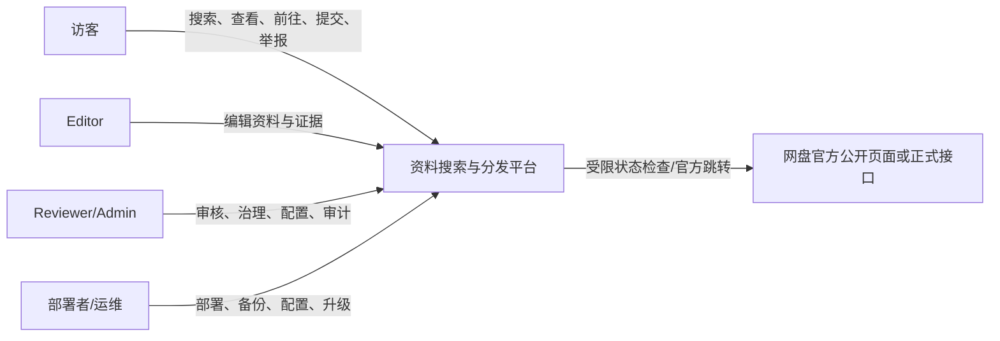
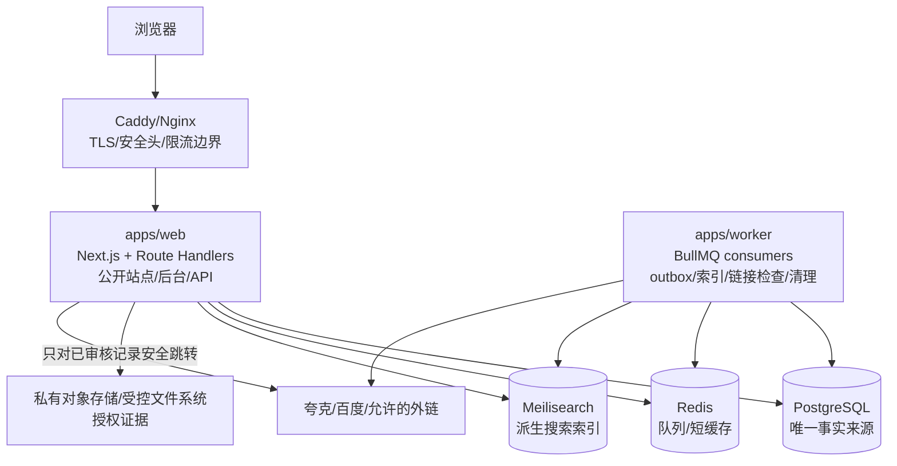
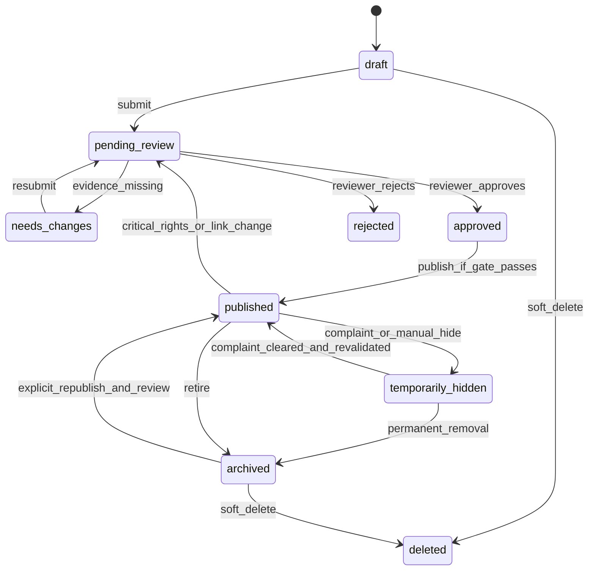
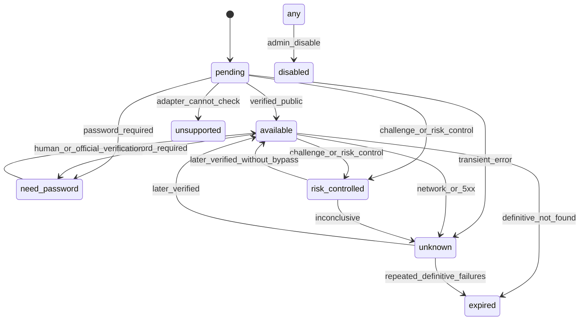

# 系统架构设计

## 1. 架构决策

采用 pnpm workspace 的模块化单体 + 独立 Worker。Next.js App Router 承载公开站点、后台和 HTTP API；Worker 消费 BullMQ 任务、outbox、链接检查、索引同步和数据清理。PostgreSQL 是业务事实源，Redis 只作队列/缓存，Meilisearch 是可重建索引。

固定技术选型：Node.js LTS、TypeScript strict、Next.js、Tailwind/shadcn、React Hook Form/Zod、PostgreSQL/Prisma、Redis/BullMQ、Meilisearch、Vitest/Testing Library/Playwright、Docker Compose、Caddy/Nginx、GitHub Actions。

## 2. C4 系统上下文

系统不代表网盘平台，不取得网盘账号权限，不抓取授权外部资料库，不接收外部平台未验证的转化数据。

## 3. C4 容器图

代码边界：`packages/core` 不依赖 Next.js；`packages/db` 只在服务端使用；`packages/search` 只生成显式索引 DTO；`packages/cloud-drives` 仅接收解析后的 URL/受控链接 DTO；客户端不得导入服务端包。

## 4. 读写与一致性数据流

### 4.1 后台写入

后台请求 -> 会话/RBAC/CSRF/Zod -> 领域状态机 -> PostgreSQL 事务（业务变更 + `outbox_events` + `audit_logs`）-> 事务提交 -> Worker 幂等消费 -> Meilisearch 更新/删除。索引失败进入重试/死信，不回滚已提交业务数据。

### 4.2 搜索读取

搜索参数先在服务端校验并规范化 -> Meilisearch 搜索候选 ID -> PostgreSQL 批量读取安全投影 -> 再次校验公开条件和链接状态 -> DTO 返回。搜索引擎不可用时公共搜索返回明确的 503；MVP 不实现 PostgreSQL 降级全文搜索，不得把索引当事实源。

### 4.3 安全跳转

`GET /go/{resourceId}/{provider}` -> 校验路径和渠道 -> 按 ID 取库 -> 检查资源公开条件/投诉/授权有效期/链接状态 -> 由适配器从数据库记录构造 URL -> 异步记录点击 -> `Cache-Control: no-store`、`Referrer-Policy`、302。请求中不能传入任意目标 URL。

### 4.4 投诉下架

通知受理 -> 完整性/可信度检查 -> 同一事务内更新 `complaint_status`/`publication_status`、写 `outbox_events`/审计/工单 -> 高优先级索引删除 -> 失败告警与重试。数据库公开条件立即失效，即使搜索索引短暂滞后也不能详情或跳转。

## 5. 资源发布状态机

领域层另行校验 `rights_status`、有效证据、链接和黑名单等发布门槛；`deleted` 仅表示公开不可见，审计/投诉/证据关联记录不可物理级联删除。

## 6. 链接检查状态机

网络、风控和验证码不等同于失效；连续确定性失败达到策略阈值才允许标记 `expired`。

## 7. 部署拓扑与信任边界

默认单 VPS：公网仅暴露 Caddy/Nginx；web、worker、PostgreSQL、Redis、Meilisearch 在私有 Docker 网络；证据存储不可公开；备份加密后发送到部署者受控位置。生产数据库、Redis、Meilisearch 必须鉴权且不直接暴露公网。

信任边界：浏览器/公网 -> edge；edge -> web；web/worker -> 数据服务；worker -> 外部平台；后台用户 -> 高权限操作。每条边界都要重新认证/授权、校验输入和记录请求 ID。

## 8. 主要故障模式

| 故障                | 影响                 | 处理                                                             |
| ------------------- | -------------------- | ---------------------------------------------------------------- |
| Meilisearch 不可用  | 公共搜索返回 503     | 写入照常提交 outbox；readiness 标记依赖异常；恢复后重放/重建索引 |
| Worker/Redis 不可用 | 索引、检查、清理延迟 | 数据库事务不丢；任务可重试；监控 backlog 和死信                  |
| 外部网盘风控/超时   | 链接状态不确定       | 标记 `risk_controlled/unknown`，不伪造失效，不绕过挑战           |
| PostgreSQL 不可用   | 读写/跳转不可用      | liveness 与 readiness 分离；备份恢复；不使用 Redis 作为事实源    |
| 索引删除失败        | 可能出现候选残留     | 数据库复核阻断公开；高优先级重试和告警                           |
| 证据存储不可用      | 审核无法完整取证     | 阻止新发布/关键变更，不删除既有审计记录                          |

## 9. ADR 摘要

### ADR-001：模块化单体 + 独立 Worker

- 决策：保留单体共享领域包，以 Worker 隔离异步任务。
- 理由：MVP 资源规模与部署场景适合低运维复杂度；索引/检查/清理仍可独立扩缩。
- 代价：包边界和幂等要求更严格；未来拆服务需保持 DTO/事件契约。

### ADR-002：PostgreSQL 为事实源、Meilisearch 为派生索引

- 决策：业务状态只在 PostgreSQL；outbox 驱动索引。
- 理由：下架、权限、审计和恢复需要事务真相；索引可重建。
- 代价：读路径多一次数据库复核，需做批量读取和性能基准。

### ADR-003：阶段二先固定 Meilisearch，完成 Typesense 实测对比

- 决策：MVP 目标引擎为 Meilisearch；在正式搜索模块实现前由 T2.7 用至少 100 条中文业务语料对比 Typesense。
- 理由：部署简单、过滤/同义词/前缀能力满足中小规模；不得用未经实测的假设替代评测。
- 变更条件：T2.7 显示关键需求不满足时，先新增 ADR 并请求确认，不能在代码中悄悄切换。

### ADR-004：UUIDv7 作为主键

- 决策：应用层生成 UUIDv7，数据库字段为 `uuid`；公开票据使用独立随机 token。
- 理由：时间排序与分布式生成兼顾；不暴露递增业务 ID。
- 代价：需固定 Node/数据库生成库版本并测试碰撞、迁移和索引表现。

## 10. 需要实施时复核

Meilisearch/Typesense 当前版本能力、CJK/拼音实现、夸克/百度公开页面与正式接口规则、平台 robots/服务条款、Caddy/Nginx 安全配置、Node.js LTS、Docker 基础镜像和中国大陆部署所需版权/个人信息/数据/广告推广/ICP/公安备案要求，都必须按实施时最新官方文档和平台协议复核。
