# 数据库设计

> 文档版本：`0.2.0-architecture-approved`

## 1. 设计约定

- PostgreSQL 为唯一事实源；Prisma 负责模型/迁移，复杂统计使用封装的参数化 SQL。
- 主键统一为应用生成 UUIDv7；时间统一 `timestamptz`、UTC 存储；公开票据/重置 token 为随机值，仅保存带密钥哈希。
- 资源、链接、工单采用软删除；审计、投诉、授权证据关联不得因删除发生意外级联。
- 所有状态枚举与 `packages/core` 状态机双重约束；版本字段用于乐观锁。
- 公开响应永不直接序列化 Prisma 对象，必须映射显式 DTO。

## 2. 实体关系

```mermaid
erDiagram
  ADMIN_USERS ||--o{ ADMIN_USER_ROLES : has
  ROLES ||--o{ ADMIN_USER_ROLES : assigns
  ROLES ||--o{ ROLE_PERMISSIONS : grants
  PERMISSIONS ||--o{ ROLE_PERMISSIONS : contains
  RESOURCES ||--o{ RESOURCE_CATEGORIES : classifies
  CATEGORIES ||--o{ RESOURCE_CATEGORIES : contains
  RESOURCES ||--o{ RESOURCE_TAGS : labels
  TAGS ||--o{ RESOURCE_TAGS : uses
  RESOURCES ||--o{ RESOURCE_SOURCES : cites
  RESOURCES ||--o{ AUTHORIZATION_RECORDS : proves
  AUTHORIZATION_RECORDS ||--o{ AUTHORIZATION_EVIDENCE : has
  RESOURCES ||--o{ RESOURCE_FILES_SUMMARY : summarizes
  RESOURCES ||--o{ CLOUD_LINKS : exposes
  CLOUD_PROVIDERS ||--o{ CLOUD_LINKS : serves
  CLOUD_LINKS ||--o{ LINK_CHECK_RECORDS : checked
  RESOURCES ||--o{ SUBMISSIONS : originates
  RESOURCES ||--o{ REPORTS : concerns
  RESOURCES ||--o{ TAKEDOWN_REQUESTS : concerns
  TAKEDOWN_REQUESTS ||--o{ COUNTER_NOTICES : answers
  RESOURCES ||--o{ CLICK_EVENTS : receives
  RESOURCES ||--o{ CONVERSION_EVENTS : receives
  RESOURCES ||--o{ OUTBOX_EVENTS : changes
  ADMIN_USERS ||--o{ AUDIT_LOGS : performs
```



## 3. 表与关键字段

### 3.1 身份与权限

`admin_users`：`id`, `username_normalized` 唯一, `email_normalized` 唯一可空, `password_hash`, `password_hash_version`, `is_disabled`, `failed_login_count`, `locked_until`, `last_login_at`, `created_at`, `updated_at`, `version`。

`roles`：`id`, `slug` 唯一, `name`, `description`, `is_system`, 时间字段。

`permissions`：`id`, `slug` 唯一, `description`。初始权限：`resource.write`, `resource.review`, `resource.publish`, `governance.handle`, `evidence.read`, `analytics.read`, `settings.write`, `admin.manage`, `audit.read`, `import.write`。

`admin_user_roles`：`admin_user_id`, `role_id`, 复合唯一；`role_permissions`：`role_id`, `permission_id`, 复合唯一。

`admin_sessions`：`id`, `admin_user_id`, `token_hash` 唯一, `created_at`, `expires_at`, `revoked_at`, `last_seen_at`, `ip_hmac` 可空、`user_agent_class` 可空。保存哈希，不保存会话 token。

`admin_password_reset_tokens`：`id`, `admin_user_id`, `token_hash` 唯一, `expires_at`, `used_at`, `created_at`；一次性、短期、只存哈希。

### 3.2 资源与权利

`resources`：`id`, `slug` 唯一（软删除部分索引）, `title`, `summary`, `cover_object_ref`, `owner_type`, `rights_status`, `review_status`, `publication_status`, `complaint_status`, `completeness_score`, `published_at`, `reviewed_by`, `reviewed_at`, `review_note_internal`, `version`, `created_at`, `updated_at`, `deleted_at`。

`categories`：`id`, `slug`, `name`, `parent_id` 可空, `is_enabled`, 时间字段；`tags`：`id`, `slug`, `name`, `normalized_name`, 时间字段。`resource_categories`：`resource_id`, `category_id`, 复合唯一；`resource_tags`：`resource_id`, `tag_id`, 复合唯一。多对多表带复合唯一约束。

`resource_sources`：`id`, `resource_id`, `source_url`, `source_url_hash`, `source_name`, `source_type`, `capture_method`, `is_public`, `created_at`, `updated_at`。来源 URL 需通过 URL 安全校验。

`authorization_records`：`id`, `resource_id`, `rights_type`, `license_name`, `license_version`, `license_url`, `grantor_name_private`, `scope_private`, `territory`, `allows_commercial_promotion`, `starts_at`, `ends_at`, `statement_private`, `verification_basis`, `status`, `verified_by`, `verified_at`, `revoked_at`, 时间字段。私人字段只给获权 reviewer/admin。

`authorization_evidence`：`id`, `authorization_record_id`, `object_ref_private`, `sha256`, `mime_type`, `byte_size`, `original_filename_redacted`, `uploaded_by`, `created_at`, `expires_at`, `deleted_at`。对象存储私有，数据库不存公开路径。

`resource_files_summary`：`id`, `resource_id` 唯一, `directory_summary`, `file_count`, `total_bytes`, `source_name`, `observed_at`, `updated_at`；允许为空。

### 3.3 网盘与跳转

`cloud_providers`：`id`, `slug` 唯一（`quark`, `baidu`, `generic`）, `display_name`, `allowed_host_patterns`, `adapter_version`, `is_enabled`。

`cloud_links`：`id`, `resource_id`, `provider_id`, `normalized_url`, `url_hash`（带密钥哈希）, `passcode_ciphertext` 可空, `current_status`, `status_confirmations`, `last_checked_at`, `next_check_at`, `redirect_template_id` 可空, `is_primary`, `is_enabled`, `deleted_at`, 时间字段。部分唯一索引保证同一资源同平台最多一个有效主链接；`url_hash` 全局去重。

`link_check_records`：`id`, `cloud_link_id`, `adapter_version`, `status`, `http_result_class`, `error_category`, `duration_ms`, `checked_at`, `next_check_at`, `response_metadata_redacted`。不得保存响应体、提取码或完整外部请求敏感信息。

`redirect_channels`：`id`, `slug` 唯一, `provider_id`, `display_name`, `template`, `allowed_placeholders`, `is_enabled`, `created_by`, 时间字段。启动时校验模板，只允许服务端白名单占位符。

### 3.4 提交与治理

`submissions`：`id`, `ticket_token_hash`, `title`, `summary`, `source_url`, `cloud_url`, `provider_hint`, `passcode_ciphertext` 可空, `rights_type`, `rights_statement_private`, `contact_private`, `truthfulness_accepted_at`, `status`, `resource_id` 可空, `reviewer_id`, `created_at`, `updated_at`, `expires_at`。

`reports`：`id`, `ticket_token_hash`, `resource_id`, `reason_code`, `description_private`, `contact_private`, `status`, `handled_by`, 时间字段。

`takedown_requests`：`id`, `ticket_token_hash`, `resource_id`, `notice_identity_private`, `contact_private`, `work_or_source_private`, `request_private`, `evidence_ref_private`, `truthfulness_accepted_at`, `status`, `handled_by`, `received_at`, `updated_at`。

`counter_notices`：`id`, `takedown_request_id`, `submitter_contact_private`, `statement_private`, `evidence_ref_private`, `status`, `handled_by`, 时间字段。

`source_blocklist`：`id`, `kind`, `normalized_value`, `reason_private`, `expires_at`, `created_by`, 时间字段；唯一约束避免重复规则。

`moderation_actions`：`id`, `resource_id`/`case_id`, `action`, `from_status`, `to_status`, `reason_private`, `actor_id`, `created_at`, `request_id`。

### 3.5 搜索与分析

`search_queries`：`id`, `normalized_query`, `filters_json`, `result_count`, `coarse_session_id`, `created_at`, `expires_at`。不保存完整 IP/指纹。

`search_suggestions`：`id`, `term`, `normalized_term`, `source`, `is_enabled`, 时间字段；`synonyms`：`id`, `terms_json`, `is_enabled`, 时间字段。

`click_events`：`id`, `resource_id`, `cloud_link_id`, `provider_slug`, `channel_slug`, `referrer_page_type`, `allowed_utm_json`, `coarse_device`, `coarse_region` 可空, `dedupe_key`, `result`, `created_at`, `expires_at`。地区无法安全处理时关闭；不保存完整 UA/Referer/IP。

`conversion_events`：`id`, `external_event_key` 唯一, `provider_slug`, `resource_id` 可空, `channel_slug` 可空, `conversion_type`, `occurred_at`, `import_batch_id` 可空, `source_description`, `verification_status`, `created_at`。只接受验签官方回调或管理员官方报表导入。

`daily_analytics`：`day`, `metric`, `provider_slug` 可空, `channel_slug` 可空, `resource_id` 可空, `value`, `updated_at`；小样本不展示细分维度。

`import_batches`：`id`, `idempotency_key` 唯一, `format`, `status`, `requested_by`, `confirmed_by`, `row_count`, `success_count`, `failure_count`, `created_at`, `confirmed_at`。

`import_rows`：`id`, `batch_id`, `row_number`, `source_hash`, `status`, `error_code`, `error_detail_redacted`, `resource_id` 可空, `created_at`；禁止以回滚名义删除既有数据。

`outbox_events`：`id`, `aggregate_type`, `aggregate_id`, `event_type`, `payload_version`, `payload_json`, `created_at`, `processed_at`, `retry_count`, `last_error_redacted`, `dead_lettered_at`。按未处理/重试索引。

`job_failures`：`id`, `job_type`, `dedupe_key`, `attempt`, `error_category`, `error_message_redacted`, `created_at`, `resolved_at`。

### 3.6 运维与审计

`audit_logs`：`id`, `actor_type`, `actor_id` 可空, `action`, `target_type`, `target_id` 可空, `request_id`, `success`, `changed_fields_summary`, `created_at`。追加写；敏感值只记“已变更”。

`system_settings`：`key` 主键, `value_json`, `is_sensitive_ref`, `updated_by`, `updated_at`；敏感值只引用环境变量/秘密管理器。

`feature_flags`：`key` 主键, `enabled`, `rollout_scope`, `updated_by`, `updated_at`。

## 4. Prisma 可迁移字段规格

本节是阶段二生成 Prisma schema 的规范。类型记法：`U`=`String @db.Uuid`（应用层生成 UUIDv7，无数据库默认）；`S`=`String @db.VarChar(n)`；`L`=`String @db.Text`；`I`=`Int`；`BI`=`BigInt`；`B`=`Boolean`；`J`=`Json`；`T`=`DateTime @db.Timestamptz(6)`；后缀 `?` 表示可空；`default now()`、`default false` 和 `default 0` 为明确默认值。所有模型都有 `created_at T default now()`，有更新能力的模型还有 `updated_at T default now()`；省略的默认值表示无默认值。

### 4.1 固定枚举

`OwnerType = deployer | authorized_submitter | third_party_rightsholder | unknown`；`RightsStatus = owned | authorized | open_licensed | public_domain | insufficient_evidence | revoked | prohibited`；`ReviewStatus = pending_review | needs_changes | approved | rejected`；`PublicationStatus = draft | published | temporarily_hidden | archived | deleted`；`ComplaintStatus = none | under_review | temporarily_hidden | restored | permanently_removed`；`LinkStatus = pending | available | expired | need_password | password_error | risk_controlled | unsupported | unknown | disabled`。

`SourceType = official_site | author_page | license_registry | public_archive | user_submitted | other`；`CaptureMethod = manual | csv_import | markdown_import | official_api`；`AuthorizationStatus = pending | active | expired | revoked | rejected`；`EvidenceVerificationStatus = pending | verified | rejected`；`SubmissionStatus = pending | needs_info | approved | rejected | withdrawn`；`ReportStatus = open | triaged | resolved | dismissed`；`TakedownStatus = received | temporarily_hidden | awaiting_response | restored | permanently_removed | closed`；`CounterNoticeStatus = received | under_review | accepted | rejected | closed`。

`HttpResultClass = none | 2xx | 3xx | 4xx | 5xx | network_error | blocked`；`ActorType = visitor | admin_user | worker | system`；`ImportStatus = preview | confirmed | processing | completed | partial_failure | failed | cancelled`；`ImportRowStatus = pending | succeeded | failed | skipped`；`OutboxEventType` 为 `resource.index.requested | resource.index.removed | link.check.requested | analytics.aggregate.requested | retention.cleanup.requested`；`ConversionVerificationStatus = pending | verified | rejected | duplicate`。

### 4.2 字段、默认值与可空性

以下是 40 个模型的字段全集；未带 `?` 的字段为 `NOT NULL`。`created_at/updated_at` 遵循本节通用约定。

| 模型                          | 字段规格                                                                                                                                                                                                                                                                                                                                                                                                                                                                                     |
| ----------------------------- | -------------------------------------------------------------------------------------------------------------------------------------------------------------------------------------------------------------------------------------------------------------------------------------------------------------------------------------------------------------------------------------------------------------------------------------------------------------------------------------------- |
| `admin_users`                 | `id U`, `username_normalized S(120)`, `email_normalized S(320)?`, `password_hash L`, `password_hash_version S(32)`, `is_disabled B default false`, `failed_login_count I default 0`, `locked_until T?`, `last_login_at T?`, `created_at T`, `updated_at T`, `version I default 1`                                                                                                                                                                                                            |
| `roles`                       | `id U`, `slug S(80)`, `name S(120)`, `description L?`, `is_system B default false`, `created_at T`, `updated_at T`                                                                                                                                                                                                                                                                                                                                                                           |
| `permissions`                 | `id U`, `slug S(120)`, `description L`, `created_at T`, `updated_at T`                                                                                                                                                                                                                                                                                                                                                                                                                       |
| `admin_user_roles`            | `admin_user_id U`, `role_id U`, `created_at T`                                                                                                                                                                                                                                                                                                                                                                                                                                               |
| `role_permissions`            | `role_id U`, `permission_id U`, `created_at T`                                                                                                                                                                                                                                                                                                                                                                                                                                               |
| `admin_sessions`              | `id U`, `admin_user_id U`, `token_hash S(128)`, `created_at T`, `expires_at T`, `revoked_at T?`, `last_seen_at T?`, `ip_hmac S(128)?`, `user_agent_class S(64)?`                                                                                                                                                                                                                                                                                                                             |
| `admin_password_reset_tokens` | `id U`, `admin_user_id U`, `token_hash S(128)`, `expires_at T`, `used_at T?`, `created_at T`                                                                                                                                                                                                                                                                                                                                                                                                 |
| `resources`                   | `id U`, `slug S(180)`, `title S(300)`, `summary L`, `cover_object_ref S(500)?`, `owner_type OwnerType`, `rights_status RightsStatus`, `review_status ReviewStatus default pending_review`, `publication_status PublicationStatus default draft`, `complaint_status ComplaintStatus default none`, `completeness_score I default 0`, `published_at T?`, `reviewed_by U?`, `reviewed_at T?`, `review_note_internal L?`, `version I default 1`, `created_at T`, `updated_at T`, `deleted_at T?` |
| `categories`                  | `id U`, `slug S(120)`, `name S(120)`, `parent_id U?`, `is_enabled B default true`, `created_at T`, `updated_at T`                                                                                                                                                                                                                                                                                                                                                                            |
| `resource_categories`         | `resource_id U`, `category_id U`, `created_at T`                                                                                                                                                                                                                                                                                                                                                                                                                                             |
| `tags`                        | `id U`, `slug S(120)`, `name S(120)`, `normalized_name S(160)`, `created_at T`, `updated_at T`                                                                                                                                                                                                                                                                                                                                                                                               |
| `resource_tags`               | `resource_id U`, `tag_id U`, `created_at T`                                                                                                                                                                                                                                                                                                                                                                                                                                                  |
| `resource_sources`            | `id U`, `resource_id U`, `source_url L`, `source_url_hash S(128)`, `source_name S(200)`, `source_type SourceType`, `capture_method CaptureMethod`, `is_public B default true`, `created_at T`, `updated_at T`                                                                                                                                                                                                                                                                                |
| `authorization_records`       | `id U`, `resource_id U`, `rights_type RightsStatus`, `license_name S(200)?`, `license_version S(80)?`, `license_url L?`, `grantor_name_private L?`, `scope_private L?`, `territory S(120)?`, `allows_commercial_promotion B default false`, `starts_at T?`, `ends_at T?`, `statement_private L?`, `verification_basis L`, `status AuthorizationStatus default pending`, `verified_by U?`, `verified_at T?`, `revoked_at T?`, `created_at T`, `updated_at T`                                  |
| `authorization_evidence`      | `id U`, `authorization_record_id U`, `object_ref_private S(500)`, `sha256 S(64)`, `mime_type S(120)`, `byte_size BI`, `original_filename_redacted S(255)?`, `uploaded_by U`, `verification_status EvidenceVerificationStatus default pending`, `created_at T`, `expires_at T?`, `deleted_at T?`                                                                                                                                                                                              |
| `resource_files_summary`      | `id U`, `resource_id U`, `directory_summary L?`, `file_count BI?`, `total_bytes BI?`, `source_name S(200)?`, `observed_at T?`, `updated_at T`                                                                                                                                                                                                                                                                                                                                                |
| `cloud_providers`             | `id U`, `slug S(40)`, `display_name S(120)`, `allowed_host_patterns J`, `adapter_version S(40)`, `is_enabled B default true`, `created_at T`, `updated_at T`                                                                                                                                                                                                                                                                                                                                 |
| `cloud_links`                 | `id U`, `resource_id U`, `provider_id U`, `normalized_url L`, `url_hash S(128)`, `passcode_ciphertext L?`, `current_status LinkStatus default pending`, `status_confirmations I default 0`, `last_checked_at T?`, `next_check_at T?`, `redirect_template_id U?`, `is_primary B default false`, `is_enabled B default true`, `created_at T`, `updated_at T`, `deleted_at T?`                                                                                                                  |
| `link_check_records`          | `id U`, `cloud_link_id U`, `adapter_version S(40)`, `status LinkStatus`, `http_result_class HttpResultClass`, `error_category S(80)?`, `duration_ms I?`, `checked_at T`, `next_check_at T?`, `response_metadata_redacted J?`                                                                                                                                                                                                                                                                 |
| `redirect_channels`           | `id U`, `slug S(80)`, `provider_id U`, `display_name S(120)`, `template L`, `allowed_placeholders J`, `is_enabled B default true`, `created_by U`, `created_at T`, `updated_at T`                                                                                                                                                                                                                                                                                                            |
| `submissions`                 | `id U`, `ticket_token_hash S(128)`, `title S(300)`, `summary L`, `source_url L`, `cloud_url L`, `provider_hint S(40)?`, `passcode_ciphertext L?`, `rights_type RightsStatus`, `rights_statement_private L`, `contact_private L`, `truthfulness_accepted_at T`, `status SubmissionStatus default pending`, `resource_id U?`, `reviewer_id U?`, `created_at T`, `updated_at T`, `expires_at T?`                                                                                                |
| `reports`                     | `id U`, `ticket_token_hash S(128)`, `resource_id U`, `reason_code S(80)`, `description_private L`, `contact_private L?`, `status ReportStatus default open`, `handled_by U?`, `created_at T`, `updated_at T`                                                                                                                                                                                                                                                                                 |
| `takedown_requests`           | `id U`, `ticket_token_hash S(128)`, `resource_id U`, `notice_identity_private L`, `contact_private L`, `work_or_source_private L`, `request_private L`, `evidence_ref_private S(500)?`, `truthfulness_accepted_at T`, `status TakedownStatus default received`, `handled_by U?`, `received_at T`, `updated_at T`                                                                                                                                                                             |
| `counter_notices`             | `id U`, `takedown_request_id U`, `submitter_contact_private L`, `statement_private L`, `evidence_ref_private S(500)?`, `status CounterNoticeStatus default received`, `handled_by U?`, `created_at T`, `updated_at T`                                                                                                                                                                                                                                                                        |
| `source_blocklist`            | `id U`, `kind S(40)`, `normalized_value L`, `reason_private L`, `expires_at T?`, `created_by U`, `created_at T`, `updated_at T`                                                                                                                                                                                                                                                                                                                                                              |
| `moderation_actions`          | `id U`, `resource_id U?`, `case_id U?`, `action S(80)`, `from_status S(80)?`, `to_status S(80)`, `reason_private L`, `actor_id U?`, `created_at T`, `request_id S(128)`                                                                                                                                                                                                                                                                                                                      |
| `search_queries`              | `id U`, `normalized_query S(500)`, `filters_json J`, `result_count I`, `coarse_session_id S(128)?`, `created_at T`, `expires_at T`                                                                                                                                                                                                                                                                                                                                                           |
| `search_suggestions`          | `id U`, `term S(300)`, `normalized_term S(300)`, `source S(40)`, `is_enabled B default true`, `created_at T`, `updated_at T`                                                                                                                                                                                                                                                                                                                                                                 |
| `synonyms`                    | `id U`, `terms_json J`, `is_enabled B default true`, `created_at T`, `updated_at T`                                                                                                                                                                                                                                                                                                                                                                                                          |
| `click_events`                | `id U`, `resource_id U`, `cloud_link_id U`, `provider_slug S(40)`, `channel_slug S(80)?`, `referrer_page_type S(80)?`, `allowed_utm_json J?`, `coarse_device S(40)?`, `coarse_region S(40)?`, `dedupe_key S(128)`, `result S(40)`, `created_at T`, `expires_at T`                                                                                                                                                                                                                            |
| `conversion_events`           | `id U`, `external_event_key S(255)`, `provider_slug S(40)`, `resource_id U?`, `channel_slug S(80)?`, `conversion_type S(80)`, `occurred_at T`, `import_batch_id U?`, `source_description L`, `verification_status ConversionVerificationStatus default pending`, `created_at T`                                                                                                                                                                                                              |
| `daily_analytics`             | `day Date @db.Date`, `metric S(80)`, `provider_slug S(40)?`, `channel_slug S(80)?`, `resource_id U?`, `value BI`, `updated_at T`                                                                                                                                                                                                                                                                                                                                                             |
| `import_batches`              | `id U`, `idempotency_key S(255)`, `format S(40)`, `status ImportStatus default preview`, `requested_by U`, `confirmed_by U?`, `row_count I default 0`, `success_count I default 0`, `failure_count I default 0`, `created_at T`, `confirmed_at T?`                                                                                                                                                                                                                                           |
| `import_rows`                 | `id U`, `batch_id U`, `row_number I`, `source_hash S(128)`, `status ImportRowStatus default pending`, `error_code S(80)?`, `error_detail_redacted L?`, `resource_id U?`, `created_at T`                                                                                                                                                                                                                                                                                                      |
| `outbox_events`               | `id U`, `aggregate_type S(80)`, `aggregate_id U`, `event_type OutboxEventType`, `payload_version I`, `payload_json J`, `created_at T`, `processed_at T?`, `retry_count I default 0`, `last_error_redacted L?`, `dead_lettered_at T?`                                                                                                                                                                                                                                                         |
| `job_failures`                | `id U`, `job_type S(80)`, `dedupe_key S(255)`, `attempt I`, `error_category S(80)`, `error_message_redacted L`, `created_at T`, `resolved_at T?`                                                                                                                                                                                                                                                                                                                                             |
| `audit_logs`                  | `id U`, `actor_type ActorType`, `actor_id U?`, `action S(120)`, `target_type S(80)`, `target_id U?`, `request_id S(128)`, `success B`, `changed_fields_summary J`, `created_at T`                                                                                                                                                                                                                                                                                                            |
| `system_settings`             | `key S(160)`, `value_json J`, `is_sensitive_ref B default false`, `updated_by U?`, `updated_at T`                                                                                                                                                                                                                                                                                                                                                                                            |
| `feature_flags`               | `key S(160)`, `enabled B default false`, `rollout_scope J?`, `updated_by U?`, `updated_at T`                                                                                                                                                                                                                                                                                                                                                                                                 |

### 4.3 加密、HMAC 与外键行为

- 应用层加密：`passcode_ciphertext`、`submissions.contact_private`、`reports.contact_private`、`takedown_requests.notice_identity_private`、`contact_private`、私人授权字段和私有陈述；密钥只来自服务端秘密管理，不与数据库同处，密文格式包含 key version/nonce/tag。
- HMAC：`url_hash`、`source_url_hash`、`token_hash`、`ticket_token_hash`、`dedupe_key`、`coarse_session_id` 和 `ip_hmac` 使用带版本的轮换密钥 HMAC-SHA-256；公开响应不暴露这些值。
- 外键默认 `RESTRICT`：管理员、角色、权限、资源、授权、投诉、审计不级联删除；资源到分类/标签/来源/链接使用 `RESTRICT` 或软删除；会话/重置 token 可在账号删除时 `CASCADE`；分析事件可按保留任务物理删除；`updated_by/handled_by/reviewed_by` 使用 `SET NULL` 保留业务记录。

### 4.4 部分唯一索引与检查约束 SQL

Prisma migration 必须保留以下手写 SQL（名称固定，实际 schema 名称按迁移生成结果确认）：

```sql
CREATE UNIQUE INDEX resources_slug_active_uq
  ON resources (slug) WHERE deleted_at IS NULL;

CREATE UNIQUE INDEX cloud_links_url_hash_active_uq
  ON cloud_links (url_hash) WHERE deleted_at IS NULL;

CREATE UNIQUE INDEX cloud_links_primary_per_resource_provider_uq
  ON cloud_links (resource_id, provider_id)
  WHERE is_primary = TRUE AND is_enabled = TRUE AND deleted_at IS NULL;

ALTER TABLE resources
  ADD CONSTRAINT resources_completeness_range_ck
  CHECK (completeness_score BETWEEN 0 AND 100);

ALTER TABLE cloud_links
  ADD CONSTRAINT cloud_links_primary_enabled_ck
  CHECK (is_primary = FALSE OR (is_enabled = TRUE AND deleted_at IS NULL));
```

`admin_users.username_normalized`、`roles.slug`、`permissions.slug`、`categories.slug`、`tags.slug`、`cloud_providers.slug`、`redirect_channels.slug`、`import_batches.idempotency_key`、`conversion_events.external_event_key` 使用普通唯一约束；多对多表和 `daily_analytics` 使用复合唯一约束。`resources` 发布门槛、`ends_at >= starts_at`、提取码长度和 URL 规范化由领域校验 + 事务内检查完成。

### 4.5 已发布资源修改策略

MVP 采用“原资源退审 + 版本字段”策略，不建立第二套公开修订表：对已发布资源的标题/简介非关键修改可按权限直接审计；权利、来源、网盘链接、授权记录、封面和禁止内容相关字段的变更必须在同一事务内将原资源 `review_status` 置为 `pending_review`、`publication_status` 置为 `temporarily_hidden` 或 `draft`（按变更类型），写 outbox 删除索引，递增 `version`，待 reviewer 再次批准后恢复公开。未通过复审前不能覆盖公开投影。

## 5. 关键约束与索引

- 资源公开门槛由领域层和数据库查询共同执行；公开查询必须过滤 `deleted_at IS NULL`。
- `resources.slug`、名称/规范化名称、提供商 slug、渠道 slug、角色/权限 slug 均唯一；软删除资源使用 PostgreSQL 部分唯一索引。
- `cloud_links`: `(resource_id, provider_id)` 上最多一个有效 `is_primary=true`；`url_hash` 唯一；启用链接必须有已启用提供商。
- `authorization_records.ends_at` 为空表示长期，但 `status` 仍必须是 `active`；过期由定时任务和公开查询双重阻断。
- `conversion_events.external_event_key` 唯一；`import_batches.idempotency_key` 唯一；重复回调返回已处理结果。
- `search_queries`, `click_events`, `link_check_records`, `audit_logs` 按时间+状态/目标索引；增长到阈值后按月分区，先做基准再实施。
- 外键默认 `RESTRICT` 或 `SET NULL`，审计/投诉/证据不可级联删除。

## 6. 状态与迁移策略

资源发布条件、链接状态机、工单状态机定义在 `docs/PRD.md` 和 `docs/ARCHITECTURE.md`；实现时由 `packages/core` 提供纯函数迁移并在数据库事务中调用。关键权利/来源/链接修改使已发布资源回到 `pending_review` 或生成待审核修订，不直接覆盖线上公开投影。

迁移要求：只使用 Prisma migration + 必要手写 SQL；不以 `db push` 代替生产迁移；向前可部署；迁移前备份；包含部分唯一索引、约束、回滚/恢复说明和空库/已有数据测试。阶段二才创建 schema 与 migration。

## 7. 数据保留与删除

具体用途、依据、访问范围和期限见 `docs/DATA_RETENTION.md`。删除任务必须幂等、有指标、有审计摘要；投诉、授权和审计所需记录不能因普通资源软删除被物理清除。
